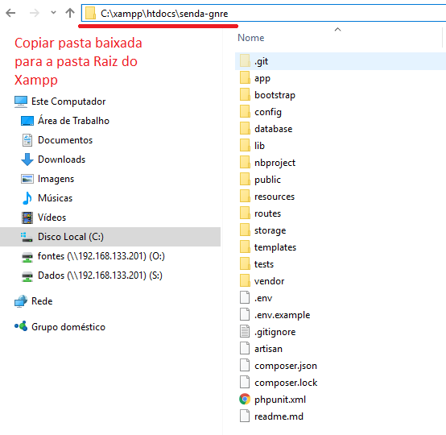
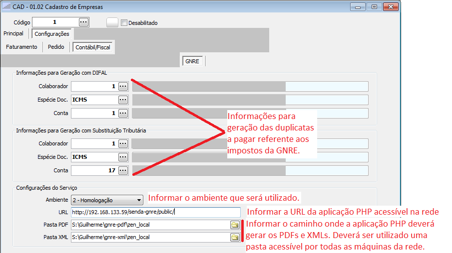
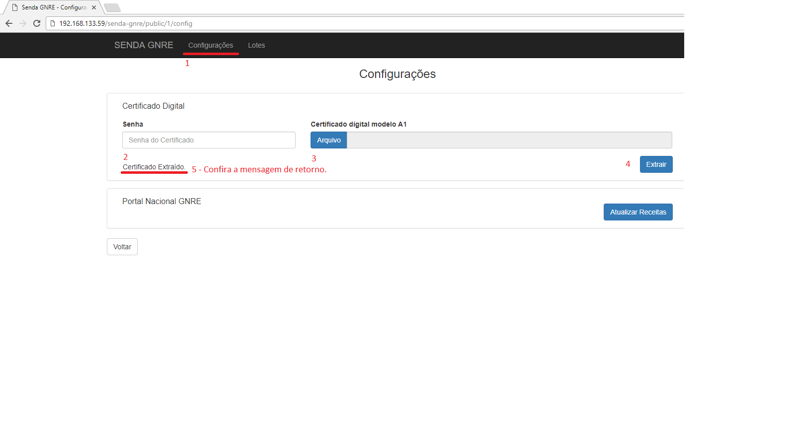
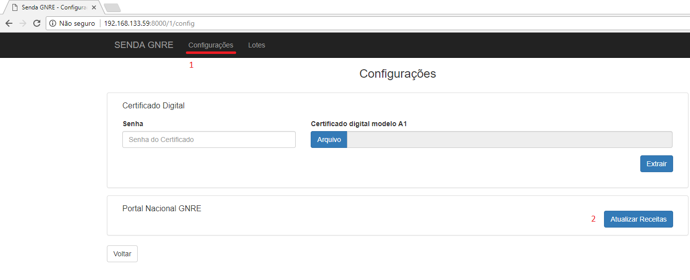

# SENDA - GNRE

SENDA - GNRE é um projeto de integração entre o sistema Senda ERP e os portais de geração GNRE.

## Documentação
SENDA - GNRE é baseado no projeto: https://github.com/nfephp-org/sped-gnre mantendo-se atualizado conforme as necessidades do sistema Senda ERP.

## Instalando o Servidor PHP
### Para plataforma windows:
- Recomenda-se baixar o XAMPP com a versão PHP 7.0.
- Download do XAMPP: "https://www.apachefriends.org/xampp-files/7.0.23/xampp-win32-7.0.23-0-VC14-installer.exe" 
- Após concluir o download do XAMPP, executar o arquivo recém baixado e seguir os passos do assistente de instalação.
- Antes de iniciar o serviço, verifique se a porta padrão a ser utilizada pelo XAMPP não está em uso por outra aplicação (Por padrão o XAMPP utiliza as portas 80 e 443). Caso tenha o skype instalado, verificar se o mesmo não esta usando as portas 80 e 443 (Menu Ferramentas - Opções - Avançado - Conexão). Desmarque a opção "Use as portas 80 e 443 como conexões de entrada adicionais" caso a mesma esteja marcada.
- Exemplos
  - Removendo o uso da porta 80 e 443 do Skype
    
- Habilitar Extenções PHP no arquivo "C:\xampp\php\php.ini" - Retire o ";" antes das extenções:
  - php_soap
  - php_openssl
  - php_gd2
  - php_pdo_pgsql
- Ajustar o parametro max_execution_time no php.ini para 500;
- Exemplos
  - Atalho para o php.ini
    
  - Arquivo php.ini
    
    

#### Após configurar o PHP.ini - Adicionar a pasta "c:/xampp/apache/bin" às variáveis de ambiente:
- Siga até as configurações do sistema, mais especificamente nas variáveis de ambiente do sistema. 
- Adicione o caminho de instalação do xampp, exemplo: "C:\xampp\apache\bin" em PATH.
- Exemplos
  - Adicionando o caminho nas variáveis de ambiente
    
    
- Pare o XAMPP e inicie novamente como ADMINISTRADOR (para extrair os dados do certificado).
- Exemplos
  - Parar o XAMPP e executar novamente como administrador
    
    
#### Verificando a instalação
- Antes de processeguir verifique através do terminal se o openssl esta instalado corretamente, através do comando:
```terminal
openssl version
```
- Verifique se o comando foi reconhecido pelo sistema, caso contrário verifique novamente se a variável de ambiente foi configurada corretamente (pode ser necessário fechar o terminal CMD e abrir novamente).
- Exemplos
  - Verificando se o sistema operacional encontrou a variável de ambiente configurada.
    
#### Estrutura de Pastas
- Recomenda-se utilizar a seguinte estrutura de pasta para instalação:
  * ..xampp/htdocs
    * senda
        * empresa
            * certificado
            * senda-gnre (copiar para esta pasta a aplicação baixada - pasta raiz da aplicação)
        * empresa
            * certificado
            * senda-gnre (copiar para esta pasta a aplicação baixada - pasta raiz da aplicação)
- Exemplos
  - Estrutura de pastas
    
#### Ajustando o arquvivo de configuração .ENV
- Assim que as dependências forem baixadas e o serviço esteja devidamente configurado conforme os passos anteriores, acesse a pasta raiz onde foi realizada a instalação.
- Configurando os dados da conexão e certificado do cliente:
    * Abra o arquivo [.env](http://github.com/sendaxe/senda-gnre/blob/master/.env) que esta na raiz do projeto e configure os dados de acesso conforme o arquivo [.env.example](http://github.com/sendaxe/senda-gnre/blob/master/.env.example)
- Exemplos
  - Definindo as configurações iniciais da aplicação (arquivo ".env" na raiz da aplicação)
    

#### Preparando o Senda para gerar GNRE
- Antes de iniciar a aplicação PHP verifique as configurações no cadastro de empresas do Senda.
- No cadastro de empresas, marque a opção "Gera GNRE" na aba "Configurações" - "Contábil/Fiscal" - "Principal".
- Após marcar a opção "Gera GNRE", configure as informações que estarão disponíveis na aba GNRE.
- Informe a url que estará sendo utilizada para rodar o serviço GNRE na opção URL (definir pelo endereço ip ou nome do servidor na rede para que todas as máquinas cliente tenham acesso a esta url). Exemplos: 
    * http://192.168.133.1/senda/empresa/senda-gnre/public
    * http://endereco-ip/senda/empresa/senda-gnre/public
    * http://nome-da-maquina-na-rede/senda/empresa/senda-gnre/public
- Exemplos
  - Configurando as informações no cadastro de empresa para que as máquinas cliente possam 'enxergar' a aplicação php que esta funcionando no servidor.
    
  - Informações a serem configuradas no cadastro de empresas do Senda ERP.
    

### Acessando a aplicação PHP
- Acesse no navegador a url: "http://endereco-ip/senda/empresa/senda-gnre/public" o caminho pode variar conforme for configurado a estrutura de pastas nos passos anteriores.
- Exemplos
  - Acesso ao serviço pelo navegador
    

### Configurando a URL de Acesso
- Acesse o sistema através da URL da pasta raiz, por exemplo: "http://192.168.133.59/sendaxe/empresa/senda-gnre/public" 
- Se preferir utilizar um endereço de acesso reduzido, crie um arquivo .BAT (windows) com os comandos abaixo:
``` terminal
cd C:\xampp\htdocs\sendaxe\empresa\senda-gnre
php -S 192.168.133.59:80 -t ./public
pause
REM Acesse a url: http://192.168.133.59 através do navegador.
```

### Atualizando/Extraindo os dados do certificado (sempre que estiver expirando)
- Este procedimento precisa estar com o XAMPP rodando em modo administrador
- Sempre que o certificado estiver expirando será necessário atualizar/extrair o certificado novo do cliente através da URL: "/configuracoes" disponível na aplicação.
- No primeiro acesso também deverá ser realizado este procedimento.
- Exemplos
  - Acessando as configurações da aplicação
    
- Confira se os dados do certificado foram extraídos corretamente
    * Após extrair o certificado, verifique a pasta informada em CERT_DIR no arquivo .ENV. Deverá ser criado automaticamente pelo sistema a pasta "metadata" dentro desta pasta.
    * Confira na pasta "metadata" se a mesma possui 2 arquivos: "certificado_certKEY.pem" e "certificado_privKEY.pem"
- Exemplos
  - Conferindo se os dados do certificado foram extraídos
    
    

### Atualizando as receitas
- Assim que os passos anteriores forem realziados, acesse a opção "Atualizar Receitas", neste momento a aplicação deverá baixar as informações específicas de cada estado, salvando os dados no Senda.
- No primeiro acesso também deverá ser realziado este procedimento.
- Exemplos
  - Atualizando as regras do portal referente aos estados e receitas (campos obrigatórios, códigos de produto, códigos de detalhamento de receita etc..).
    
## Licença
[MIT license](http://opensource.org/licenses/MIT)
